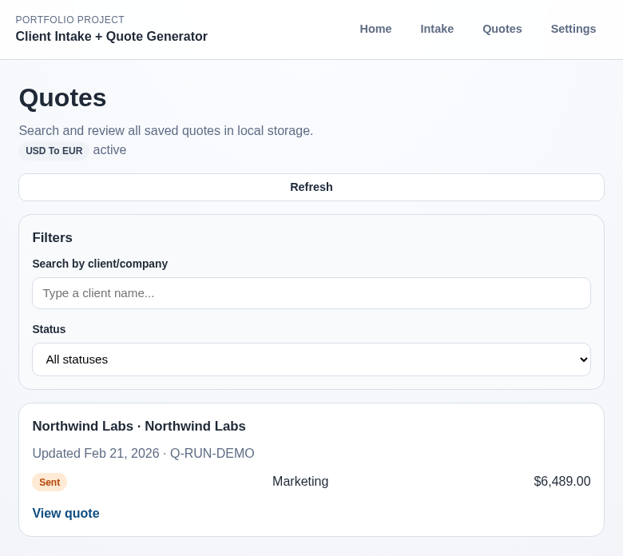
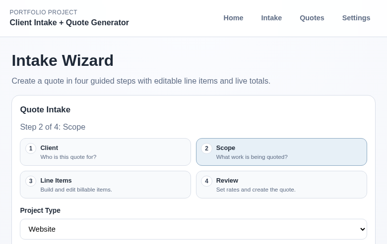
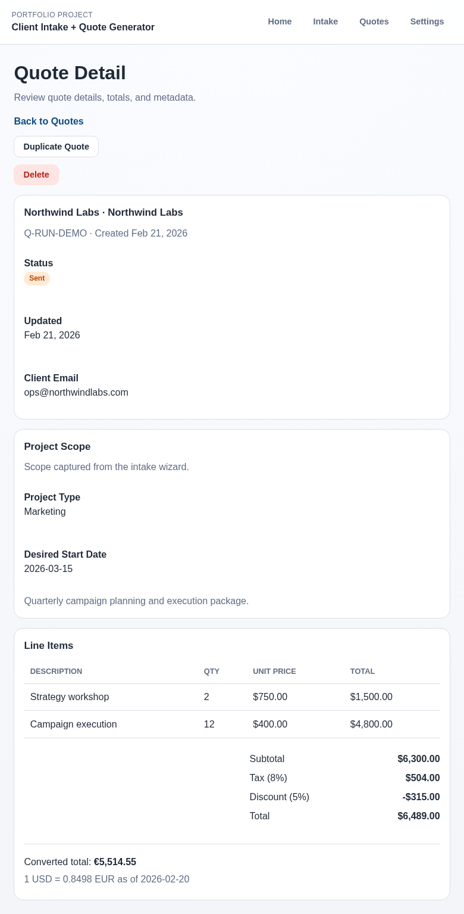

# Client Quote Generator

Live Demo: https://REPLACE_ME.netlify.app  
GitHub: https://github.com/DevCalebR/client-quote-generator

Client intake wizard and quote workflow portfolio project built with React + TypeScript + Vite.

## Features

- Multi-step intake wizard with validation
- Editable line items and automatic totals
- Quote list/search/filter and detail views
- Local persistence for quotes and app settings
- Live FX conversion preview with cached exchange rates and graceful fallback

## Local Development

```bash
npm install
npm run dev
```

## Deploy to Netlify

- Build command: `npm run build`
- Publish directory: `dist`
- Runtime: Node 20+
- SPA refresh support: `public/_redirects` must contain `/* /index.html 200`

## Screenshots






